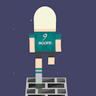
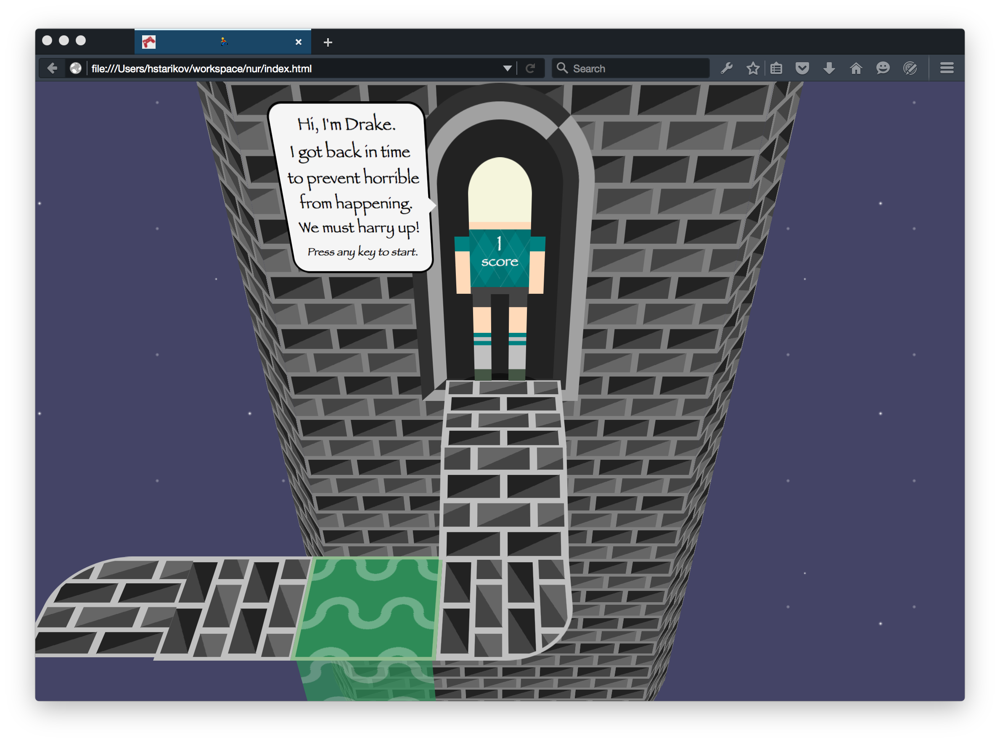

Drake's quest :runner:
----------------------

My entry for [js13k](http://js13kgames.com/) 2015 game contest.

It's a typical "turn right, left, and jump" runner game. Unlike most of other games, submitted for the contest, this one is heavily based on CSS3. Which, it seems, led to <6k final package size.

### Controls
- turn right and left with arrow keys
- jump with space
- press any key to start

### I want to thank
- [Andrzej Mazur](http://end3r.com/) for maintaining this contest
- [Lea Verou](http://lea.verou.me) for inspiration
- [Andrej Hronco](http://www.keithmcmillen.com/blog/making-music-in-the-browser-web-audio-api-part-1/) for a nice tutorial on audio api
- [Jerry Momoda](http://jerrymomoda.com/analysis-endless-runners/) for a great overview of the genre

### Browser Support
- Best performance is in latest chrome
- Game also works in firefox

### Features
- zoom in on start screen
- screenshots in readme

### Bugs
- double down rendering from side

### Done
- run animation
- static track
    * straight
    * right, left
    * jump
    * top, down
- moving track
- jump animation
- player hands
- step sounds
    * run, jump
- initial screen
    * controls
- controls, game over validation (conf)
    * jump, turn
- fall animation
    * water, aside, forward
- jump is too short
- make initial background move back and become transparent
- fix shadow
- show next key on the screen
